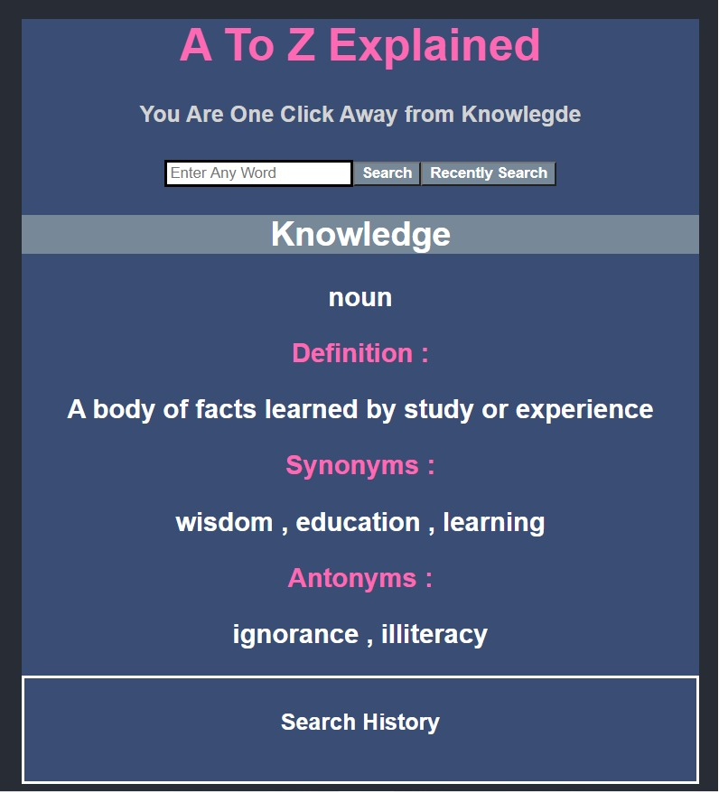
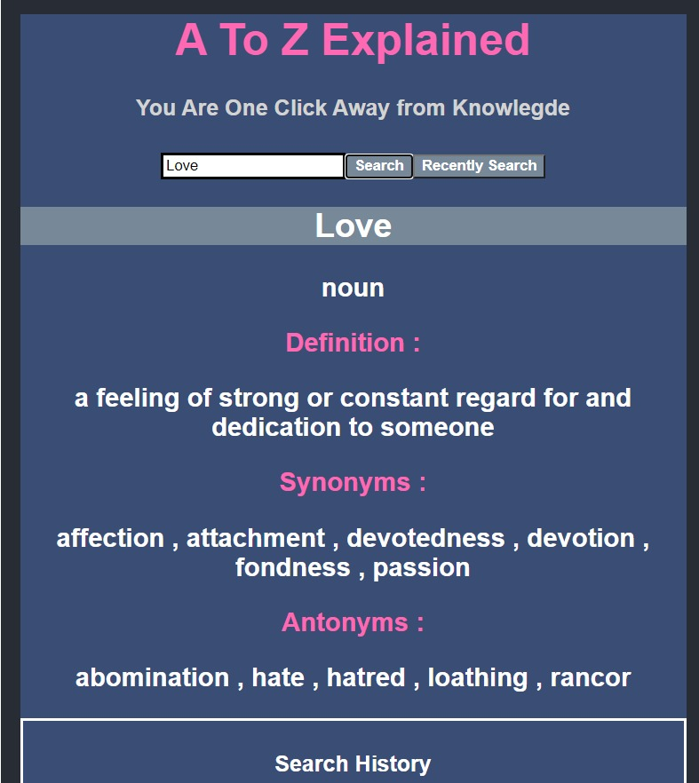
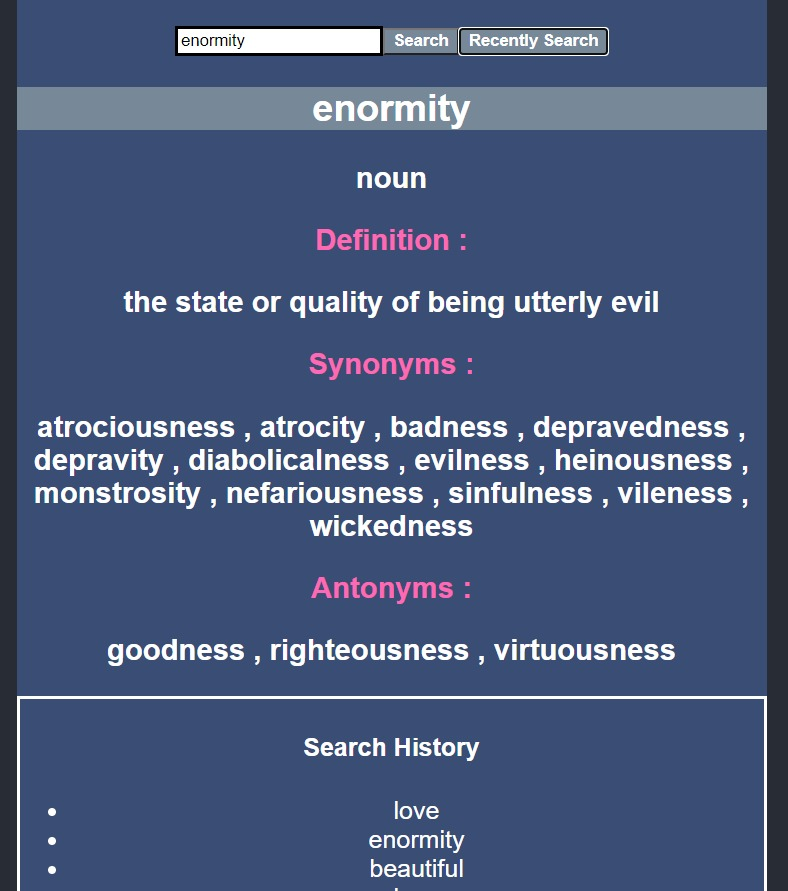
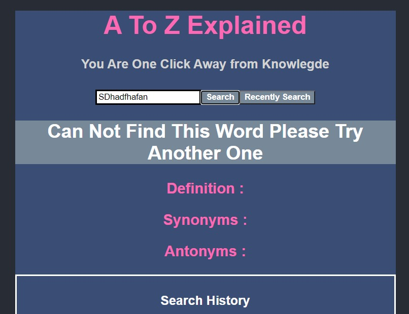

# Project Name

## From A To Z explained (Dictionary)

## Sub-Heading
 Accurate , easy and fast dictionary using External API .

## Summary
You are one click away from knowlegde. This project is an easy to use dictionary, 
that makes understanding English easy by deliever word definitions for you with a click of a button.

## Problem
Sometimes, we have trouble understanding english word and we'r too lazy to search for it. so we miss the chance to learn.

## Solution
My product will make it easier and faster to search by allowing the user to enter any word , and immediatly have the definition for it. Learning becomes effortless and instant.

## Quote 
Never miss a chance to enrich your knowlegde and widen vocabulary.

## How to Get Started
- Clone or download this repo .
- Open it in a code editor (exemple: Visual Studio Code ) .
- In the root directory install the dependencies : npm install
- Run the Command : npm run react-dev 
- Run the Command : npm run server-dev 

## Customer Quote
easy to use and efficient dictionary .

## Closing and Call to Action
It's action time , let's see what i can do => you are welcome to try my product.
